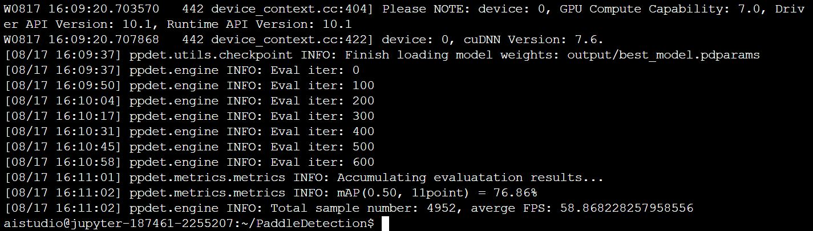

# Paddle-YOLOv2

English | [简体中文](./README_CN.md)

## 1、Introduction

This project is based on the paddlepaddle_V2.1 framework to reproduce YOLOv2(YOLO9000). YOLOv2 is the second generation model of YOLO series. For the first time, it makes YOLO series model detect based on anchor frame, and proposes multi-scale training methods, which lays the foundation for subsequent YOLOv3, YOLOv4, YOLOv5 and PPYOLO.

**Paper:**
- [1] Redmon J, Farhadi A. YOLO9000: better, faster, stronger[C]//Proceedings of the IEEE conference on computer vision and pattern recognition. 2017: 7263-7271.

**Reference project：**
- [https://github.com/pjreddie/darknet](https://github.com/pjreddie/darknet)

**The link of aistudio：**
- notebook：[https://aistudio.baidu.com/aistudio/projectdetail/2290810](https://aistudio.baidu.com/aistudio/projectdetail/2290810)

## 2、Accuracy

The model is trained on the trainval set of VOC2007 and VOC2012, and tested on the test set of VOC2007.

The mAP given in the paper when the input size is 416x416 is 76.8%, and the mAP obtained in this project is 76.86%.


## 3、Dataset

[VOC2007+VOC2012 Dataset](https://aistudio.baidu.com/aistudio/datasetdetail/63105)
- Dataset size:
    - Training set: 16,551
    - Test set: 4952
- Data format: standard VOC format, marked with rectangular boxes
## 4、Requirements

- Hardware：CPU、GPU（Tesla V100-32G is recommended）

- Framework：
  - PaddlePaddle >= 2.1.2
  
## 5、Quick Start

### step1: clone 

```bash
# clone this repo
git clone https://github.com/nuaaceieyty/Paddle-YOLOv2.git
cd Paddle-YOLOv2
export PYTHONPATH=./
```
**Install dependencies**
```bash
pip install -r requestments.txt
```

### step2: Training

1. Create an Output folder in the top level directory and download darknet backbone pre-training weights (I have converted the official darknet weight to .pdparams) here: https://aistudio.baidu.com/aistudio/datasetdetail/103069.
2. This project can be trained using a single card Tesla V100-32G. Note: VOC dataset should be prepared in advance, and decompressed into the data directory under the top-level directory (data set address is: https://aistudio.baidu.com/aistudio/datasetdetail/63105). If the dataset address is incorrect, change the corresponding address to the absolute path in the configs/datasets/voc.yml file.

```bash
python3 train.py -c configs/yolov2/yolov2_voc.yml --eval --fp16
```

### step3: Evaluating
Note: Make sure the best_model.pdparams file is in the output directory.
```bash
python3 tools/eval.py -c configs/yolov2/yolov2_voc.yml
```

### Prediction using pre training model

Put the images to be tested in the data directory, run the following command, and save the output images in the Output directory; If there is a GPU in the machine environment, delete -o use_gpu=False from the command

```bash
python3 predict.py -c configs/yolov2/yolov2_voc.yml --infer_img data/dog.jpg -o use_gpu=False
```
The result is shown as follows：


## 六、Code structure

### 6.1 Structure

```
├─config                          
├─model                           
├─utils                           
├─data                            
├─output                          
│  eval.py                        
│  predict.py                     
│  README.md                      
│  README_CN.md                   
│  requirements.txt               
│  train.py                       
```
### 6.2 Parameter description

Parameters related to training and evaluation can be set in `train.py`, as follows:

|  Parameters   | default  | description | other |
|  ----  |  ----  |  ----  |  ----  |
| config| None, Mandatory| Configuration file path ||
| --eval| None, Optional| Evaluate after an epoch |If you don't select this, you might have trouble finding the best_model|
| --fp16| None, Optional| Semi-precision training |If this option is not selected, 32GB of video memory may not be sufficient|
| --resume| None, Optional | Recovery training |For example: --resume output/yolov2_voc/66|

### 6.3 Training process

See 5、Quick Start

## 7、Model information

For other information about the model, please refer to the following table:

| information | description |
| --- | --- |
| Author | YU Tianyang(EICAS)|
| Date | 2021.08 |
| Framework version | Paddle 2.1.2 |
| Application scenarios | Object detection |
| Support hardware | GPU、CPU |
| Download link | [Pre training model](https://aistudio.baidu.com/aistudio/datasetdetail/103354)|
| Online operation | [notebook](https://aistudio.baidu.com/aistudio/projectdetail/2290810)|